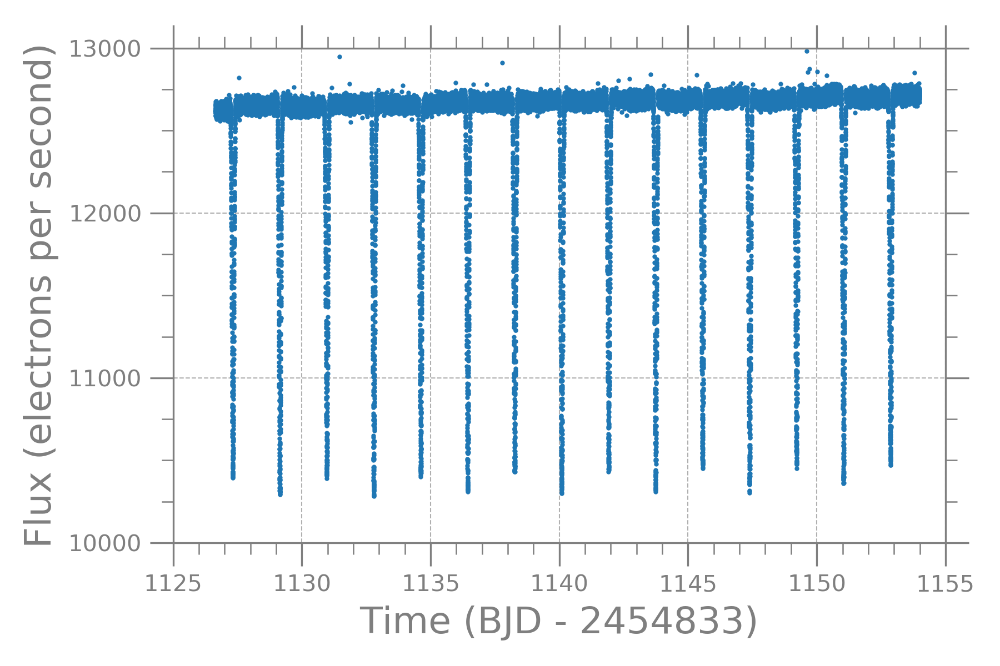

<h1 align="center">
  Eclipsing Binaries
</h1>

Time series analysis in search for eclipsing binary stars can be daunting. Sometimes, it takes hours--even days or months--to find a single eclipsing binary in a dataset. However, when you find one, it is exciting. The following is an example light curve for target Kepler Object of Interest (KOI) 3570.

### KOI-3570
KOI-3570 (aliases: 2MASS J19405783+4009273, KIC 5023948, and WISE J194057.82+400927.3) is an eclipsing binary star system.

### Getting the data: FITS file
If you're familiar getting FITS files, then download the data from [Nasa Exoplanet Archive](https://exoplanetarchive.ipac.caltech.edu).

## Phase Fold Lightcurve
Arguably, one of the most important parameters to find for an eclipsing binary star system is the orbital period. There are many ways to find the period around the center of mass and the method I like to use is a multi-term Lomb-Scargle approach. For this system, I used the period published in Brewer et al. 2016. They found an orbital period of 3.649301 days. Phase folding the light curve with this orbital period yields the following plot. The secondary and primary eclipses are at about phase equal to 0.2 and 0.7, respectively.