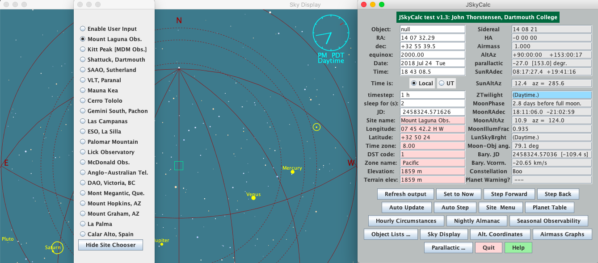

<h1 align="center">
  JSkyCalc
</h1>
<p align="center">A convinient, portable observing aid.</p>



Skycalc expedites the "time-and-the-sky" calculations needed by observational astronomers.

### Install and Setup
1. Go to Oracle-Java website and download the `dk-8u121-macosx-x64.dmg` file.
2. Go to JSkyCalc website and download the executable tar file.
3. Use command `mkdir ~/JSkyCalc` to create an empty directory in your home directory and name it `JSkyCalc`. Then, move executable tar file `JSkyCalc.jar` into this directory.
4. Use command jar -xvf JSkyCalc.jar from within ~/JSkyCalc directory to unpack jar file.
5. Edit skycalcsites.dat to add Mount Laguna Observatory as the first site (above Kitt Peak)--it will become the default. You may have to comment out an observatory to make room.

   ```sh
   "Mount Laguna Obs.", 7.76173, 32.84, 8., 1, "Pacific", "P", 1859., 1859.
   ```
6. Add following lines to your `~/.bash_profile` file:

   ```sh
   # use jsky command in any directory to start JSkyCalc
   alias jsky='java JSkyCalc'
   CLASSPATH=$CLASSPATH:~/JSkyCalc
   export CLASSPATH
   ```
7. Finally, use the command `source ~/.bash_profile` to source the file and then use jsky command to start using JSkyCalc from any directory! 
8. The following line is the general format for JSkyCalc (.dat) files:

   ```sh
   Name_no_blanks hh mm ss dd mm ss equinox +++
   ```

   It's fine if all your stars have equinox=2000. Here is an example of `observe-star.dat` formatted for JSkyCalc.

   ```sh
   some_star 00 37 52.92 -09 42 16.5 2000.0 +++
   ```