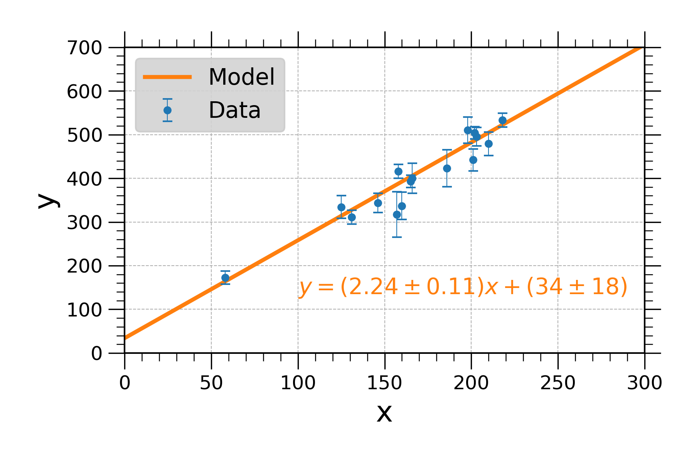

<h1 align="center">
  Fitting a Line to Data
</h1>
<p align="center">From Hogg et al. 2010</p>

## Exercise 1
Using the standard linear algebra method of this Section, fit a straight line $y = mx + b$ to the $x$, $y$, $\sigma_y$ values for data points 5 through 20 in Table 1 on page 6. That is, ignore the first four data points, and also ignore the columns for $\sigma_x$ and $\rho_{xy}$. Make a plot showing the points, their uncertainties, and the best-fit line. Your plot should end up looking like Figure 1. What is the standard uncertainty variance $\sigma^2_m$ on the slope of the line?

Table 1 on page 6:
```
ID x y sig_y sig_x rho_xy
1 201 592 61 9 -0.84
2 244 401 25 4 0.31
3 47 583 38 11 0.64
4 287 402 15 7 -0.27
5 203 495 21 5 -0.33
6 58 173 15 9 0.67
7 210 479 27 4 -0.02
8 202 504 14 4 -0.05
9 198 510 30 11 -0.84
10 158 416 16 7 -0.69
11 165 393 14 5 0.30
12 201 442 25 5 -0.46
13 157 317 52 5 -0.03
14 131 311 16 6 0.50
15 166 400 34 6 0.73
16 160 337 31 5 -0.52
17 186 423 42 9 0.90
18 125 334 26 8 0.40
19 218 533 16 6 -0.78
20 146 344 22 5 -0.56
```

Linear Regression Function:
```python
def linear(objectx, objecty, objectey):
    '''
    Returns (b, m) values from y = mx + b linear regression.
    Parameters
    ----------
    objectx : array_like
        Independent variable, usually labeled as the x values.
    objecty : array_like
        Dependent variable, usually labeled as the y values.
    objectey : array_like
        Gaussian uncertainties in the y direction.
    Returns
    -------
    (b, eb, m, em) : scalars
        There are two best-fit and their respective standard uncertainty
        variances. The values are returned in a set.
    '''
    import numpy as np
    from numpy.linalg import inv

    # Create matrices and solve the best-fit values.
    Y = objecty
    A = np.matrix([np.ones_like(Y), objectx]).T
    C = np.diag(pow(objectey, 2))
    X1 = inv(A.T @ inv(C) @ A)
    X2 = A.T @ inv(C) @ Y
    X =  X2 @ X1
    return (X.item(0), np.sqrt(X1.item(0)), X.item(1), np.sqrt(X1.item(3)))
```

Read the date, remove unwanted lines, and preform linear regression.
```python
import matplotlib.pyplot as plt
import numpy as np
import pandas as pd

df = pd.read_csv('table1.dat', sep=' ')
df = df[4:]
b, eb, m, em = linear(df['x'], df['y'], df['sig_y'])
x = np.linspace(0, 300)
y = m * x + b
```

Plot the data:
```python
plt.errorbar(df['x'], df['y'], yerr=df['sig_y'], label='Data')
plt.plot(x, y, label='Model')
```
